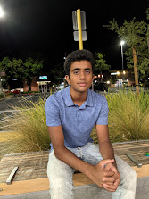

# Neelkanth Shitolay



## Background
Hello, I'm Neelkanth! I'm a Computer Engineering student passionate about software engineering. So far in the course, I have created the file, [README.md](README.md) and worked with git. 


## Basic Information
1. I am from Cupertino, California, home of Apple. You can learn more about the company [here](https://www.apple.com/).
2. Some of my hobbies include: [running, swimming, and watching football]


## General

### Tasks I hope to accomplish this quarter
- [x] Finish **Lab 1**
- [ ] Meet *new* people through the course and improve my software skills

### Favorite Quote
> "You miss 100% of the shots you don't take." - Michael Jordan

### Favorite Colors
- Orange
* Blue
+ Green

### My first code that I wrote
Here's the Java code I wrote for the first time:
```java
System.out.println("Hello, this is Neelkanth!");

